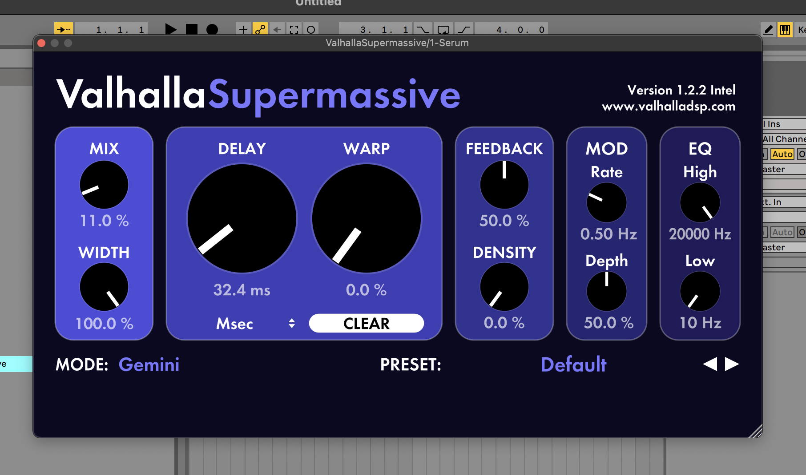
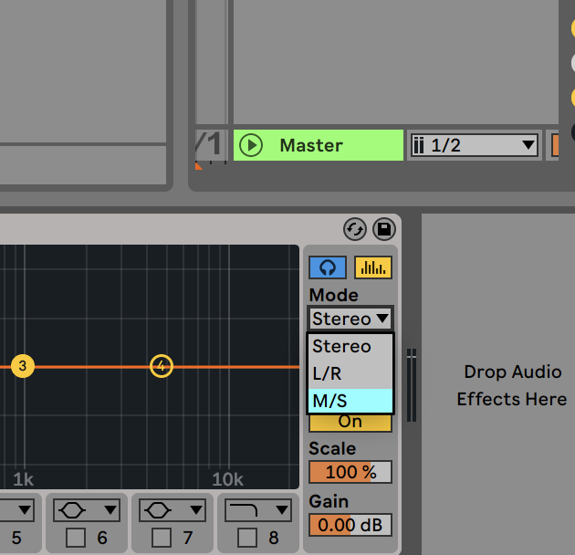
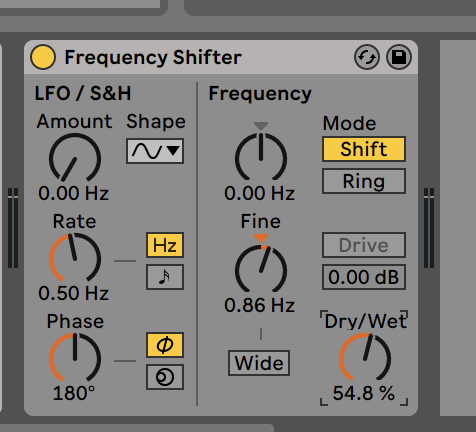
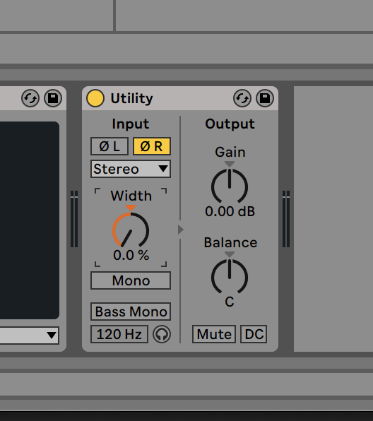

# my favourite vst or effects

## VST section (FREE)

### DSEQ2 DEMO

    is kinda really smart plugin that automatically does eq your sound.
    it says demo but at least u can control threthold knob to eq your sound. 
    put this on ur lead or supersaw chord stacks!

### Valhalla SuperMassive

    is a convolution of delay and frequency shifter.
    i use this as a reverb to enhance the atmosphere.

    like this, few mix and tiny frequency of delay makes your sound so fresh.

### Vital

    is a wavetable synthesizer similar to xfer serum.

### GCLIP

    saturator or clippling plguin.

### spitfire LABS

    free raw insrtuments which is a very high quality samples in it

### MeldaProduction Free FX bundle

    this includes really powerful VSTs like...

    - MAutoPitch(similar to AutoTune)
    - MCharmVerb(similar to Disperser)
    - MSaturator(badass saturator, i put this at the master channel)

### vocal doubler

    doubler sounds like 80s or 90s something

## VST section (PAID)

i barely buy plugin so...

### xfer serum

    wavetable synth

### fabfilter proq3

    eq, but live eq is enough at least for me...

### WAVESTATION by korg

    library synth, probably u like this synth
    sounds really legacy tho

## ableton stocks

### OTT preset of Maltiband Dynamics

    makes louder

### Soft button of Glue Compressor

    great sound without clipping ur sound

### M/S and headphone button of EQ

    headphone button, u can only listen to the part of frequency ur holding(?)

    and M/S, literally u can do Mid Side EQing
    sometime low-end frequency of Side makes my sound horrible so i use this alot.

### yoink sound using frequency shifter

    little bit bring up the fine and turn down the dry/wet to 50% then sounds yoink
    u can find y when u only bring up the fine knob

### play only side sounds using Utility

    0(R|L) means basically reversing the waves.